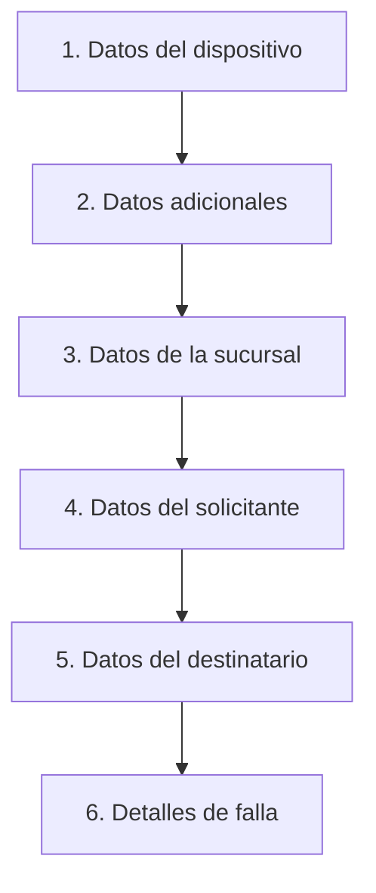

# Análisis de Tipificación de Incidentes — Canal Directo

> Sesión: 2026-06-29 | Continuación pendiente

---

## Contexto y objetivo

El sistema actual (`webagentes.canaldirecto.com.ar`) registra incidentes de impresoras. Este dashboard
(`Reporte-incidentes`) consume esos datos vía SOAP y los analiza.

**Objetivo final:** reemplazar la tipificación por IA con una tipificación determinista real, tanto
en la **apertura** como en el **cierre** del incidente, sin necesidad de modelos de lenguaje.

---

## Estado actual del sistema

### Campos que se capturan al ABRIR (en webagentes)

| Campo | Tipo | Estado |
|-------|------|--------|
| Descripción/Reporte del cliente | Texto libre | ✅ Capturado |
| Fallas | Checkboxes (Atasca papel, Imprime mal, etc.) | ✅ Capturado |
| Mensaje de error | Texto libre | ✅ Capturado |
| Observaciones | Texto libre | ✅ Capturado |
| Número de serie (`maquina`) | Texto | ✅ Capturado |
| Solicitante | Campo | ✅ Capturado |
| **Impacto** | — | ❌ No existe |
| **Urgencia** | — | ❌ No existe |
| **Prioridad** | — | ❌ No existe |
| **Categoría al abrir** | — | ❌ No existe |

### Campos que se capturan al CERRAR (en webagentes + este dashboard)

| Campo | Estado |
|-------|--------|
| Causa (diagnóstico del técnico) | ✅ Capturado |
| Solución / Bitácora de trabajos | ✅ Capturado |
| Técnico asignado | ✅ Capturado |
| Fecha de cierre | ✅ Capturado |
| **Categoría/Subcategoría** (antes: por IA) | ✅ Implementado en dashboard |

### Tipo `Incident` en `src/lib/types.ts`

Campos relevantes:
```typescript
maquina?: string          // S/N del equipo
descripcion: string       // texto libre del cliente
causa?: string            // diagnóstico del técnico
solucion?: string         // qué hizo el técnico
trabajos?: IncidentJob[]  // bitácora completa
categoria?: string        // tipificación actual (post-cierre)
subcategoria?: string
```

### Flujo actual (problemática)

```
Apertura → campo libre ("Atasca Papel") → SIN categoría
Cierre   → técnico llena causa + solución → IA tipifica → dashboard muestra
```

**Consecuencia:** mientras el incidente está **abierto**, no hay tipificación posible.
No se puede reportar "cuántos incidentes de Hardware están abiertos ahora".

---

## Lo que revela el corpus (`classification-cache.json`)

Distribución real de títulos de apertura en los datos históricos:

| Título de apertura | % aprox | Problema |
|--------------------|:-------:|----------|
| "Atasca Papel" | ~50% | Mapea a 4 categorías distintas según lo que hizo el técnico |
| "Imprime Mal (Rayas / Manchas / Borroso)" | ~25% | 3 categorías distintas según tipo de defecto |
| "Pieza rota / suelta" | ~8% | Hardware → Parte o Fusor |
| "No enciende" | ~5% | Hardware o Recambio |
| "Error en display / Aviso" | ~5% | Varía según el código exacto |
| "No se comunica a la red" | ~3% | Software/Red |
| "Toma varias hojas" | ~2% | Rodillos |
| "No reconoce la bandeja" | ~2% | Hardware varios |

**Insight clave:** "Atasca Papel" (50% de los casos) se distribuye en:
- `Medio de Impresion → Atasco de papel (comun)` — cuando fue un atasco simple y se retiró
- `Hardware y Desgaste → Fusor` — cuando se reemplazó el fusor
- `Hardware y Desgaste → Rodillos / Pickup` — cuando se reemplazaron rodillos
- `Hardware y Desgaste → Otros` — cuando se reemplazaron otras piezas

El síntoma del cliente es demasiado amplio. Se necesita un segundo nivel de pregunta.

---

## Solución propuesta: 3 campos condicionales (árbol de decisión)

### Decisión de diseño

- **Sin IA.** Tipificación 100% determinista via lookup table.
- **3 campos condicionales** en el formulario de apertura.
- El **técnico confirma o corrige** al cerrar.
- El dashboard puede mostrar categoría estimada desde la apertura.

---

### Campo 1 — Síntoma principal *(siempre visible)*

Reemplaza el campo de texto libre con dropdown de 9 opciones:

```
¿Qué problema presenta la impresora?
  ○ Traba / atasca el papel
  ○ Calidad de impresión defectuosa (rayas, manchas, borroso)
  ○ Muestra un error o mensaje en la pantalla
  ○ No enciende / no responde a ningún comando
  ○ No imprime desde la PC (pero la impresora enciende)
  ○ No toma papel de alguna bandeja
  ○ Pieza rota o suelta
  ○ Solicitud de mantenimiento / recambio de equipo
  ○ Otro (describe brevemente)
```

---

### Campo 2 — Detalle del síntoma *(condicional según Campo 1)*

**Si eligió "Traba / atasca papel":**
```
¿Con qué frecuencia ocurre?
  ○ Pasó una sola vez / esporádicamente
  ○ Ocurre seguido (varias veces por semana)
  ○ Ocurre casi siempre al imprimir

¿Hay síntomas adicionales? (múltiple selección)
  ☐ La hoja sale arrugada
  ☐ Se siente olor a quemado
  ☐ Hace ruido extraño al pasar el papel
  ☐ No toma papel de la bandeja (no entra)
  ☐ Ninguno de los anteriores
```

**Si eligió "Calidad de impresión defectuosa":**
```
¿Qué tipo de defecto aparece en la hoja impresa?
  ○ Rayas o líneas verticales (de arriba hacia abajo)
  ○ Rayas o líneas horizontales (de lado a lado)
  ○ Manchas de toner (zonas negras o grises)
  ○ Imprime muy claro / casi no se lee
  ○ Borroso en un sector de la hoja
  ○ Letras de distintos tamaños
```

**Si eligió "Muestra un error en pantalla":**
```
Ingrese el código o texto exacto que aparece en la pantalla:
  [_____________________]
  (ej: "31 Error Disk", "SOLICITA MANTENIMIENTO", "111112")
```

**Si eligió "No toma papel de alguna bandeja":**
```
¿De qué bandeja no toma?
  ○ Bandeja 1 (principal / inferior)
  ○ Bandeja 2
  ○ Bandeja multiuso / manual
  ○ ADF (alimentador de hojas para escanear)
  ○ No toma de ninguna bandeja
```

**Si eligió "No imprime desde la PC":**
```
¿La impresora imprime si usás el botón del panel?
  ○ Sí, desde el panel imprime bien  →  (problema de PC/driver/red)
  ○ No, no imprime de ninguna forma  →  (problema del equipo)
```

---

### Campo 3 — ¿Desde cuándo? *(siempre visible, opcional)*

```
¿Cuándo empezó este problema?
  ○ Hoy, por primera vez
  ○ Hace varios días o semanas
  ○ Es intermitente (va y viene)
  ○ Siempre tuvo este problema desde que lo tenemos
```

---

## Tabla de lookup determinista (sin IA)

| Campo 1 | Campo 2 | → Categoría apertura | → Subcategoría apertura |
|---------|---------|----------------------|------------------------|
| Atasca papel | Esporádico + sin síntomas extra | Medio de Impresion | Atasco de papel (comun) |
| Atasca papel | Frecuente + arruga hojas + olor | Hardware y Desgaste | Fusor / Kit de mantenimiento |
| Atasca papel | Frecuente + no entra el papel | Hardware y Desgaste | Rodillos / Pickup / Separacion |
| Atasca papel | Frecuente + ruido + pieza suelta | Hardware y Desgaste | Parte / Panel / Botonera rota |
| Calidad | Rayas horizontales | Insumos y Toner | Toner / Cartucho |
| Calidad | Rayas verticales | Insumos y Toner | Calidad por insumo (manchas / impresion clara) |
| Calidad | Manchas de toner | Insumos y Toner | Drum / Unidad de imagen / Revelador |
| Calidad | Muy claro | Insumos y Toner | Drum / Unidad de imagen / Revelador |
| Calidad | Borroso en sector | Hardware y Desgaste | Fusor / Kit de mantenimiento |
| Error en pantalla | "SOLICITA MANTENIMIENTO" | Insumos y Toner | Drum / Unidad de imagen / Revelador |
| Error en pantalla | Código 6x (disco) | Hardware y Desgaste | Otros - Hardware y Desgaste |
| Error en pantalla | Código red/IP | Software, Firmware y Red | Configuracion de red / IP |
| No imprime desde PC | Sí imprime desde panel | Software, Firmware y Red | Driver / PC / Spooler |
| No imprime desde PC | No imprime de ninguna forma | Hardware y Desgaste | Otros - Hardware y Desgaste |
| No toma papel | Bandeja específica | Hardware y Desgaste | Rodillos / Pickup / Separacion |
| Pieza rota | — | Hardware y Desgaste | Parte / Panel / Botonera rota |
| No enciende | — | Hardware y Desgaste | Otros - Hardware y Desgaste |
| Mantenimiento / Recambio | — | Gestion de Soporte | Recambio Definitivo |

> **Nota:** la tabla cubre ~80% de los casos. El 20% restante (múltiples síntomas combinados,
> casos edge) queda como "Pendiente de revisión" y el técnico asigna al cerrar.

---

## Flujo completo con la mejora

```
ANTES:
  Apertura → campo libre ("Atasca Papel") → sin categoría
  Cierre   → técnico completa causa + solución → IA tipifica → dashboard

DESPUÉS:
  Apertura → 3 campos → lookup table → categoría asignada al abrir
  Cierre   → técnico ve categoría sugerida → confirma o corrige
  (sin IA en ningún paso)
```

### Nuevas métricas posibles una vez implementado

| Métrica | Valor |
|---------|-------|
| Distribución de categorías en incidentes ABIERTOS | Ver qué tipo de problema es el más frecuente ahora |
| % categoría apertura = categoría cierre | Mide precisión del diagnóstico inicial del operador |
| Tiempo apertura → primera acción (por categoría) | ¿Se atienden primero los casos de Hardware crítico? |
| Tasa de re-tipificación | Cuántos incidentes cambian categoría entre apertura y cierre |

---

## Radiografía del formulario actual (webagentes — 2026-06-30)

> URL: `webagentes.canaldirecto.com.ar/incidents/add`
> Serie analizada: `0BLQBJLK100004L` (Samsung MFP Mono A3 SL-K4350LX)

### Estructura del formulario



### Inventario de campos (25 elementos, página plana ~3930px)

| # | Sección | Campo | Tipo | ¿Oblig.? | Observación |
|---|---------|-------|------|:---:|------|
| 1 | Dispositivo | Nro. Serie | Texto + Verificar | ✅ | Dispara auto-fill |
| 2 | Dispositivo | Marca | Readonly (auto) | Auto | Samsung |
| 3 | Dispositivo | Modelo | Readonly (auto) | Auto | MFP Mono A3 SL-K4350LX |
| 4 | Adicionales | Ticket relacionado | Texto | ❌ | — |
| 5 | Adicionales | Origen | Dropdown | ❓ | "Teléfono" visible |
| 6–9 | Sucursal | Sucursal/Sector/Tel/Dir | Readonly (auto) | Auto | EZE - Hangares |
| 10–15 | Solicitante | Apellido/Nombre/Tel/Email/Sector/Emails alt. | Texto | ✅/❓ | — |
| 16–22 | Destinatario | Mismos 6 campos + "Copiar del solicitante" | Texto | ❌ | Ruido visual |
| 23 | Falla | Falla | ❓ Dropdown/Checks | ✅ | Genérico |
| 24 | Falla | Agregar/Eliminar falla | Botones | — | — |
| 25 | Falla | Observaciones | Textarea | ❌ | — |

---

## Problemas detectados vs. mejores prácticas

### 🔴 Críticos

| # | Problema | Impacto | ¿Quién lo resuelve? |
|---|---------|---------|---------------------|
| P1 | **Sin categoría/tipificación al abrir** | No se puede reportar distribución de problemas abiertos | Zendesk, Jira, ServiceNow, Freshservice: TODOS lo tienen |
| P2 | **Sin prioridad/urgencia/impacto** | Todos los tickets pesan igual; no hay ruteo automático | ServiceNow: Impacto × Urgencia = Prioridad automática |
| P3 | **Campo "Falla" demasiado genérico** | "Atasca papel" = 50% de casos pero mapea a 4 categorías | Freshservice/ServiceNow: sub-categorías condicionales |

### 🟠 Importantes

| # | Problema | Impacto |
|---|---------|---------|
| P4 | **Formulario plano** de scroll largo (~3930px) | Fatiga visual, abandono |
| P5 | **Destinatario ocupa 6 campos** que casi siempre se copian | Ruido innecesario |
| P6 | **Sin validación en tiempo real** visible | No queda claro qué es obligatorio |
| P7 | **Sin confirmación post-envío** con ETA | El usuario no sabe qué pasará después |

---

## Comparativa lado a lado: Canal Directo vs. Top 5

| Capacidad | Canal Directo | Zendesk | Jira SM | ServiceNow | Freshservice | Intercom |
|-----------|:---:|:---:|:---:|:---:|:---:|:---:|
| **Categoría al abrir** | ❌ | ✅ | ✅ | ✅ | ✅ | ✅ (bot) |
| **Sub-categoría condicional** | ❌ | ✅ | ✅ | ✅ | ✅ | ❌ |
| **Prioridad / Urgencia** | ❌ | ✅ | ✅ | ✅ (auto) | ✅ | ❌ |
| **Impacto** | ❌ | ❌ | ✅ | ✅ | ✅ | ❌ |
| **Formulario multi-paso** | ❌ | Parcial | ✅ | ✅ | ✅ | ✅ (chat) |
| **Campos condicionales** | ❌ | ✅ | ✅ | ✅ | ✅ | ✅ |
| **Validación en tiempo real** | ❌ | ✅ | ✅ | ✅ | ✅ | ✅ |
| **Auto-fill datos equipo** | ✅ ⭐ | ❌ | Parcial | ✅ (CMDB) | ✅ | ❌ |
| **Auto-fill datos sucursal** | ✅ ⭐ | ❌ | ❌ | ✅ | Parcial | ❌ |
| **Deflexión KB** | ❌ | ✅ | ✅ | ✅ | ✅ (Freddy) | ✅ |
| **Confirmación con ETA** | ❌ | ✅ | ✅ | ✅ | ✅ | ✅ |
| **Adjuntar archivos/fotos** | ❓ | ✅ | ✅ | ✅ | ✅ | ✅ |
| **Historial del equipo** | ❌ | ❌ | ❌ | ✅ (CMDB) | ✅ | ❌ |

> **Fortaleza:** auto-completado de equipo y sucursal por S/N es mejor que Zendesk y Jira nativos.

---

## Recomendaciones priorizadas

### Fase 1 — Quick Wins

| # | Mejora | Esfuerzo | Impacto |
|---|--------|:---:|:---:|
| 1.1 | Agregar campo **Categoría** (dropdown) al formulario de apertura | Bajo | 🔴 Crítico |
| 1.2 | Agregar **Subcategoría condicional** según categoría | Medio | 🔴 Crítico |
| 1.3 | Colapsar "Datos del destinatario" por defecto | Bajo | 🟠 Alto |
| 1.4 | Marcar campos obligatorios con `*` + validación en tiempo real | Bajo | 🟠 Alto |
| 1.5 | Reemplazar "Falla" genérico por **árbol de decisión 3 niveles** | Medio | 🔴 Crítico |

### Fase 2 — Mejoras de experiencia

| # | Mejora | Esfuerzo | Impacto |
|---|--------|:---:|:---:|
| 2.1 | **Wizard multi-paso** (Equipo → Quién → Falla → Confirmar) | Alto | 🟠 Alto |
| 2.2 | **Prioridad automática** (Impacto × Urgencia) | Medio | 🟠 Alto |
| 2.3 | Confirmación post-envío con # ticket y ETA | Bajo | 🟡 Medio |
| 2.4 | Adjuntar foto del error/falla | Medio | 🟡 Medio |

### Fase 3 — Roadmap futuro

| # | Mejora | Esfuerzo | Impacto |
|---|--------|:---:|:---:|
| 3.1 | Historial del equipo visible al cargar S/N | Alto | 🟠 Alto |
| 3.2 | Portal self-service para cliente final | Muy Alto | 🟡 Medio |
| 3.3 | Deflexión KB — sugerir soluciones antes de crear ticket | Alto | 🟡 Medio |

---

## Mockups del formulario rediseñado (2026-06-30)

> Mockups en `docs/mockups/` — Wizard de 4 pasos

| Paso | Mockup | Cambio principal |
|:---:|--------|-----------------|
| 1 | [paso1-equipo.png](file:///c:/Users/imartinez.CDSA/Desktop/Proyectos/Reporte-incidentes/docs/mockups/paso1-equipo.png) | S/N + auto-fill en paso dedicado |
| 2 | [paso2-problema.png](file:///c:/Users/imartinez.CDSA/Desktop/Proyectos/Reporte-incidentes/docs/mockups/paso2-problema.png) | Tipificación condicional + categoría sugerida |
| 4 | [paso4-confirmar.png](file:///c:/Users/imartinez.CDSA/Desktop/Proyectos/Reporte-incidentes/docs/mockups/paso4-confirmar.png) | Resumen + prioridad + ETA antes de enviar |

---

## Pendiente para la próxima sesión

- [ ] Definir si la tabla de lookup vive en webagentes (como cambio al formulario) o en este
      dashboard (como capa de interpretación sobre los datos SOAP existentes)
- [ ] Analizar qué campos adicionales expone el SOAP que aún no se consumen
- [ ] Revisar si los checkboxes actuales de "Fallas" en webagentes se pueden reemplazar o
      complementar con los nuevos campos propuestos
- [ ] Diseñar la lógica de `categoriaApertura` en `src/lib/` para el dashboard
- [ ] Discutir la tipificación al CIERRE: ¿cómo mejora el técnico la categoría hoy? ¿qué falta?
- [ ] Completar la tabla de lookup con casos edge (síntomas combinados)
- [ ] Diseñar Paso 3 "Contacto" (mockup pendiente)

